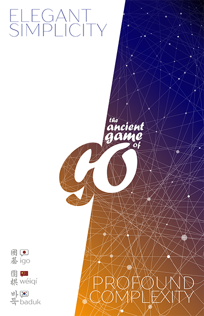
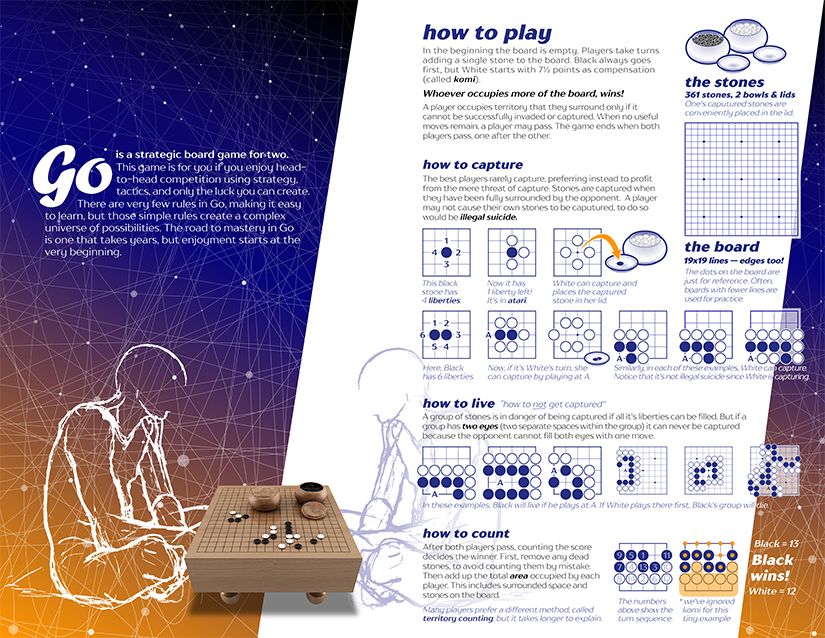
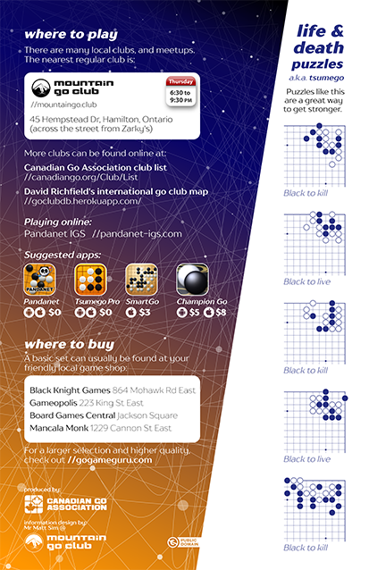

# Go handout

A brochure for introducing people to the game of Go.

* 2-sided bi-fold
* paper size: ANSI A (US Letter)
* print-ready PDF: [go-handout_2016+3mmbleed.pdf](go-handout_2016+3mmbleed.pdf)

|recommended paper type: | min| best* | max |
|---|---|---|---|
| cover stock: | 60 lb | 65 lb | 80 lb |
| approx. GSM: | 160  | 175 | 215 |
| approx. points| 7pt | 8pt | 10pt |

\* *probably the best weight, I'll update after we print some. The in-house proofs on 80lb are nice but the fold has a bit too much spring.*

#### Required fonts
[TT Drugs](https://www.myfonts.com/fonts/type-type/tt-drugs/)

[Monotype Forte](https://www.myfonts.com/fonts/type-type/tt-drugs/)

#### Optional fonts
Chinese & Japanese: [Diannippon Screen HiraginoGyo](http://www.screen-hiragino.jp/lineup/hgyo/)

Korean: [Microsoft Gungsuh](https://www.microsoft.com/typography/fonts/family.aspx?FID=358)

## License

To the extent possible under law, [Mr Matt Sim](http://perceptual.space) has waived all copyright and related or neighbor
