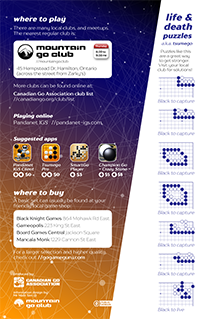

# Go handout

A brochure for introducing people to the game of Go.

* 2-sided bi-fold
* paper size: ANSI A (US Letter)
* print-ready PDF: [go-handout_2016+3mmbleed.pdf](https://github.com/MrMattSim/go-handout/raw/master/go-handout_2016+3mmbleed.pdf)
* standard envelope address stickers can be used to replace location details on the back

|recommended paper type: | min| best* | max |
|---|---|---|---|
| cover stock: | 60 lb | 65 lb | 80 lb |
| approx. GSM: | 160  | 175 | 215 |
| approx. points| 7pt | 8pt | 10pt |

\* _probably the best weight, I'll update after we print some. The in-house proofs on 80lb are nice but the fold has a bit too much spring._

  

_Created in [Inkscape](https://inkscape.org) with some help from [GIMP](https://gimp.org)._

#### Required fonts
* [Monotype Forte](https://www.myfonts.com/fonts/type-type/tt-drugs/)
* [TT Drugs](https://www.myfonts.com/fonts/type-type/tt-drugs/)

The files for TT Drugs that I had were split into discrete styles instead of under a single family name. So I use FontForge to edit the font info (Family, SubFamily, and OS/2 classes for good measure; don't know if that last one matters). The benefit is that Inkscape will group the whole family and manage style variations. The down side is that I can't distribute it and you'll need to fix any font issues.

#### Optional fonts
* Chinese & Japanese: [Diannippon Screen HiraginoGyo](http://www.screen-hiragino.jp/lineup/hgyo/)
* Korean: [Microsoft Gungsuh](https://www.microsoft.com/typography/fonts/family.aspx?FID=358)

## License

To the extent possible under law, [Mr Matt Sim](http://perceptual.space) has waived all copyright and related or neighboring rights to this work.
